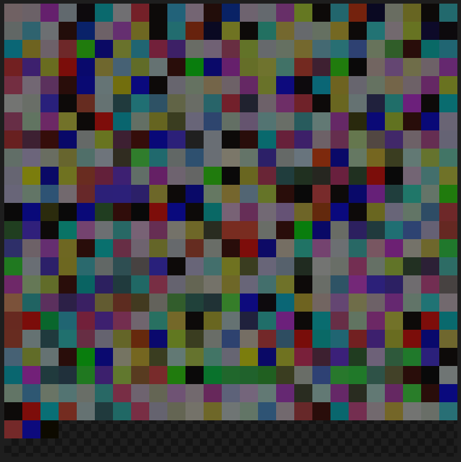

# imgurdb

a program that stores itself in a picture and can get itself out



_actual size:_


## running/installation

```bash
git clone https://github.com/paxprose/imgurdb.git

cd imgurdb
go mod tidy
```

from here you can build an executable (make sure you're in the same folder as the `main.go` file)

```bash
go build main.go
start main.exe
```

this will output a `/imgs/main.png` image file.

if you want to read the `.png`:

```bash
# the argument is whever the picture's path is:
start main.exe "C:\go\src\github.com\paxprose\imgurdb\imgs\image.png"
```

and see the source code in your console!
